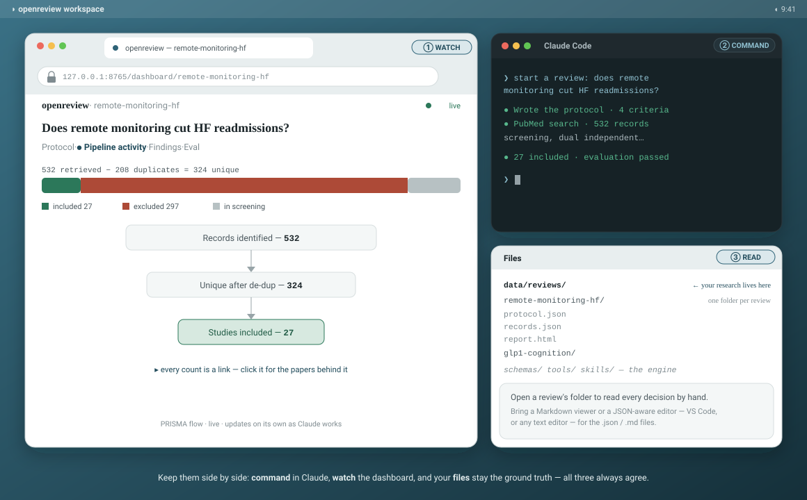

# openreview

*Do a thorough, defensible PubMed search the way a systematic review would — without the heavyweight process.
Light enough for a Tuesday-afternoon question, rigorous enough to publish.*

> **Not affiliated with openreview.net** (the conference peer-review platform). Different project.

## What it is

openreview helps you search PubMed, screen what comes back against your own criteria, and pull out what
matters — and it records every step, so the result is auditable end to end: every paper you included, every
one you excluded and why, every count tracing back to the records behind it. You run it by **talking to an AI
assistant** (Claude): you say what you want, it does the searching and screening, and it keeps everything as
plain files you own. Think of it as a research assistant that shows all of its work.

Use it for a formal systematic review, or for any question where you want to search thoroughly and be able to
show — to a reviewer, a co-author, or yourself in six months — exactly how you reached your answer.

**Who it's for:** researchers who live in PubMed and care about defensible results — clinicians, grad students
and postdocs, research librarians, epidemiologists, evidence-synthesis teams — and who are comfortable working
through a coding agent. That's the one real cost of entry: you operate openreview through Claude Code, so you
(or someone on your team) need to be willing to get set up with it. If you've used a coding agent before,
you're past the hard part.

## How you use it

There's no app to install and no website to log into. openreview is a **folder you keep on your computer**,
operated through [Claude Code](https://claude.com/claude-code) — an AI assistant that can read files and run
programs. You open the folder in Claude Code and talk to it: *"search PubMed for remote monitoring and
heart-failure readmissions,"* *"screen the results against these criteria,"* *"why was this one excluded?"* It
does the work and writes everything down. (It's built and tested with Claude Code; in principle any capable
coding agent could operate it, but start there.)

<p align="center">
  
</p>

The way you run this day to day: keep a **browser window with the dashboard open next to your Claude Code
session** (the terminal or the desktop app) — and, if you like, a file browser or editor on the side to read
the raw files. While you work, the review shows up in these three places, and they always agree:

- **The conversation** — you and Claude, in plain language. This is how you drive everything: you ask, it
  acts, and it tells you what it did and what it needs you to decide.
- **A live dashboard** — a page in your browser that shows the review taking shape: the search funnel, what
  was excluded and why, what's included so far. It updates on its own as Claude works. (One command to start
  it — see Quickstart.)
- **The files** — your research lives under `data/reviews/`, **one folder per review**; every record,
  decision, and criterion is a plain `.json`/`.md` file, yours to open in any text editor or Markdown viewer
  and keep. Nothing is hidden in a database you can't see.

The conversation is where you *act*, the dashboard is where you *watch*, the files are the *ground truth*
under both.

### Three ways to talk to Claude

It's the same chat window doing three different jobs — worth knowing all three from the first day:

- **Command it.** This is how you run the system: start a review, tighten a criterion, re-run a search,
  export the result. When a review says *Needs you* — a screening conflict, or a paused quality gate —
  you resolve it right here in plain language (*"exclude 12345, wrong population"*). There are no commands
  to memorize; you never touch a terminal unless you want to.
- **Ask it how things work.** Anything on the dashboard you don't understand, ask the assistant that built
  it: *"what does 'excluded at full text' mean here?"*, *"why is this review paused?"*, *"walk me through
  what I'm looking at."* Being confused is never a dead end.
- **Push it further.** The report and tables are a starting point, not the last word: *"group the included
  studies by year,"* *"which exclusions were the closest calls?"*, *"chart the findings,"* *"draft a methods
  paragraph from this."* Ask for the cut you want and it builds it from the same underlying files.

## Why you can trust it

Anyone can produce a list of papers. What makes a review worth something is that you can *check* it — follow
any claim back to the record it rests on, and re-derive every number yourself. openreview is built so you can:

- **Every number traces to its records.** The dashboard is a live **PRISMA flow** — the identification →
  screening → included funnel every reviewer knows — and every count is a link. Click *excluded at
  title/abstract*, a single exclusion reason, or *included*, and the exact papers behind it open. No number is
  a dead end.
- **Nothing is written by hand.** Every view and the exported report is generated from the underlying files by
  a script, so nothing can drift from the evidence. Rebuild it and it is identical.
- **Screening is instrumented, not improvised.** Records can be screened by *two independent* AI passes; the
  tool reports their agreement (Cohen's κ) and routes every disagreement or low-confidence call to *you* to
  decide. Each decision — who judged, how, and how a conflict was resolved — is recorded on the record.
- **Every decision carries its reason.** An exclusion without a reason from your protocol's list is invalid
  data, not just bad practice — the tools refuse it.

If you want to distrust a conclusion, the system is arranged so you can.

## Quickstart

You need [Claude Code](https://claude.com/claude-code) and Python 3. PubMed needs no account and no API key.

**1. Get the folder.** Clone (or download) this repo, then install the one dependency:

```bash
git clone https://github.com/orchestrator-studios/openreview.git
cd openreview
pip install -r requirements.txt
```

**2. Open the folder in Claude Code and just ask.** *"Start a review: does remote monitoring reduce
heart-failure readmissions after discharge?"* Claude opens the **live dashboard** for you — a small local
server at http://127.0.0.1:8765/ — then interviews you for the criteria, writes the protocol, and runs the
PubMed search. A card for your review appears on the dashboard on its own. *(Prefer to run the dashboard
yourself, or just want to explore the bundled example first? `python tools/server.py`. It ships with one
finished example inside — a real PubMed review on genetic susceptibility to asbestos-induced mesothelioma in
mice — so there's something to explore from the first minute.)*

**3. Follow along.** The dashboard interrupts you — with a pop-up, not a quiet card — at the two moments that
matter. First, the moment Claude finishes the **protocol**: a modal shows you the question and criteria it
set out to find, and *"See it"* drops you into the review on **Search & screening**, where you watch the
funnel fill. Then, when the review is done, a second modal tells you **the report is ready** — or that it's
paused for a decision only you can make. In between, move across the stops at the top (**Search & screening**,
**Findings**) and click any number to see the exact papers behind it. Leave the page open beside your chat
and it calls you when there's something to see.

**4. Expect some back-and-forth.** A review isn't a one-way conveyor. Claude loops back when it should —
re-running or widening the queries after seeing the first results were too broad or too thin, re-screening a
batch, filling a gap the quality gate flagged. The highlighted stage shows where it is *right now*; watching it
step backward is the review getting better, not breaking. And it's real work — a thorough search can return
hundreds of records, and screening each one twice (two independent AI passes) runs for a while and spends
Claude usage as it goes. Ask for a narrower question or a calibration sample if you want the first run small.

Not sure what something on the dashboard means? Ask Claude — it built the page and will explain any part of
it. (There's also a **How this works** button on the dashboard itself.)

## What you see

Everything a review produces lives in one **interactive report** — the same view you watch live on the
dashboard and the one the export freezes to a file. It reads left to right as three stops, and *every number
in it is a link*:

- **Protocol** — your question and PICO, the inclusion criteria, the controlled list of exclusion reasons, and
  the search strategy. The queries are shown in plain text, with the exact PubMed commands one toggle away for
  anyone who wants to reproduce them from a terminal.
- **Search & screening** — the live **PRISMA flow** every systematic reviewer knows: records identified →
  duplicates removed → excluded at title/abstract → assessed at full text → included, under a reconciling
  snapshot bar (*retrieved − duplicates = unique*, split green included / red excluded / neutral in-screening).
  No count is a dead end — click *excluded at title/abstract*, a single exclusion reason, *assessed at full
  text*, or *included*, and the exact papers behind that number open.
- **Findings** — the results, gated by quality. At the top, a **quality gate** — completeness and integrity
  checks that either pass, or pause the review and tell you exactly what needs a human. Below it, the included
  studies and a **compiled extraction table**: the structured fields pulled from each study, one row per study
  arm, grouped and colour-coded by the outcome that matters, ready to read or drop into a write-up.

**The records explorer is where the audit trail pays off.** From any count you land in a searchable,
filterable list of exactly those papers — and opening any one shows its abstract, **which query (or queries)
surfaced it**, and its full **screening trail**: what each of the two independent reviewers decided, how
confident they were, the inclusion criterion it met or the reason it was excluded, and how any conflict was
adjudicated — plus whether it was judged on full text or only the abstract. You can follow any paper from the
top-line PRISMA number all the way down to the sentence-level reason it's in or out.

And one **Export** button freezes the whole thing — PRISMA counts, records, every screening trail, the
extraction table — to a single self-contained HTML file you can email or attach to a submission. Same numbers,
every drill-down link still works, no server needed.

## Honest about its limits

- **LLM-assisted screening is a rigorous _aid_, not a replacement for dual _human_ screening under a
  registered protocol.** It instruments and records the process so it can be audited; it does not take
  responsibility for your included set off your shoulders.
- **Full-text screening reaches only open-access papers.** The second screening pass fetches full text from
  PubMed Central (PMID-verified) with an Unpaywall fallback; when neither yields open-access text it screens
  the abstract instead and records `basis: abstract` on that record, so the limit is visible on the record,
  not hidden. Paywalled PDFs behind a publisher login aren't retrieved. The bundled example leans on abstracts
  for much of its extraction — treat it as a demonstration of shape, not a clinical dataset.
- **Conflicts and low-confidence calls in the bundled example were adjudicated with a light touch** — the
  agreed decisions accepted and borderline title/abstract cases carried to full text — rather than
  hand-reviewed one by one. It's a demonstration of the mechanism working end to end, not a clinical result.

## Under the hood

For the curious — the design that makes the guarantees hold.

- **A reusable engine, per-review data.** The engine (`schemas/`, `tools/`, `skills/`, and the versioned
  screening agent) knows nothing about any topic; each review supplies its own question, criteria, and the
  shape of the data it extracts, all under `data/reviews/<slug>/`. Same machinery, any subject.
- **One source of truth.** Every surface — the dashboard, the export, the files — reads the same projection
  from `tools/repo.py`. There is one definition of the funnel; nothing recomputes it, so nothing can disagree.
- **The rules are enforced, not aspirational** (`tools/validate.py` fails otherwise): schemas are law; views
  are regenerated, never hand-edited; every record traces to a search; exclusions carry a reason and conflicts
  carry an adjudication; provenance is never backfilled.

Start with `OVERVIEW.md` (what the system is), `CLAUDE.md` (how the agent operates inside it), and
`docs/dashboard-spec.md` (the review view's layout).

## License

[MIT](LICENSE) © Orchestrator Studios

---

Feedback and issues welcome — that's the point. Open a GitHub issue.
